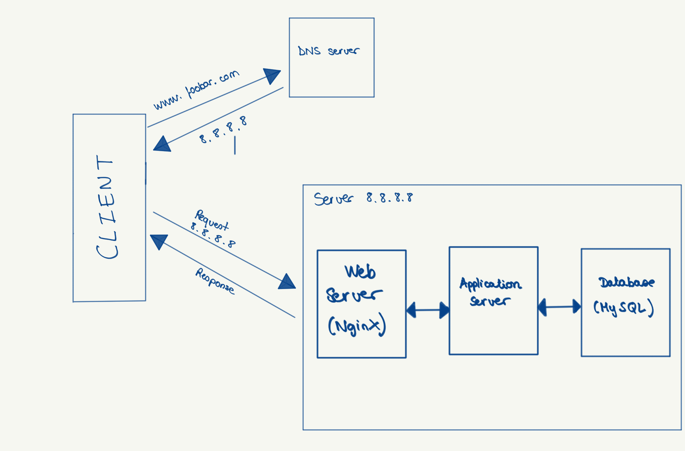

## Specifics about the infrastructure

- **What is a server**  
  A server is a computer (physical or virtual) that provides services, data, or applications to other computers (called clients) over a network. In web infrastructure, servers host websites, applications, and databases.

- **What is the role of the domain name**  
  A domain name is a human-readable address (e.g., `www.foobar.com`) that maps to the IP address of a server. It makes websites easier to access without needing to remember numeric IPs.

- **What type of DNS record *www* is in `www.foobar.com`**  
  `www` is usually represented as a **CNAME record** (an alias) pointing to the root domain (`foobar.com`), or sometimes as an **A record** pointing directly to an IP address.

- **What is the role of the web server**  
  The web server (e.g., Nginx, Apache) handles HTTP requests from clients. It serves static files (HTML, CSS, JS, images) and forwards dynamic requests to the application server.

- **What is the role of the application server**  
  The application server runs the business logic of the application (e.g., Python, PHP, Ruby, Node.js). It processes requests, interacts with the database, and generates dynamic responses.

- **What is the role of the database**  
  The database stores, organizes, and retrieves structured information (e.g., user data, products, transactions). It supports queries from the application server.

- **What is the server using to communicate with the computer of the user requesting the website**  
  The server communicates with the client’s browser using the **HTTP/HTTPS protocol** over the **TCP/IP network stack**.

---

## Issues with this infrastructure

- **SPOF (Single Point of Failure)**  
  If a single server or component fails (for example, the only web server or database), the entire system goes down.

- **Downtime during maintenance**  
  If the web server or application server needs to be restarted (e.g., when deploying new code), the website becomes unavailable temporarily.

- **Cannot scale with high traffic**  
  With only one server handling all requests, performance decreases and the server may crash if the traffic load is too high.

