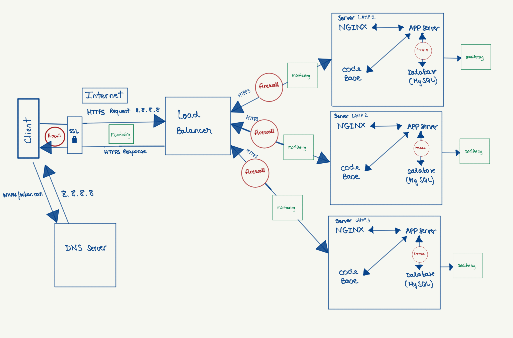

## Specifics about the infrastructure

### Added elements and why
- **Additional Web Servers**: Added to distribute traffic, increase availability, and allow horizontal scaling.  
- **Load Balancer (HAProxy) cluster**: Added to distribute requests evenly across web servers and provide high availability.  
- **Separate Application Server**: Isolates the application logic from static content serving, improves maintainability, and allows independent scaling.  
- **Separate Database Server(s)**: Isolates data storage, improves performance, and allows read/write separation in Primary-Replica setup.  
- **Firewalls**: Added to filter incoming and outgoing traffic, enhancing security by allowing only trusted connections.  
- **HTTPS (SSL/TLS)**: Ensures secure, encrypted communication between clients and servers, protecting sensitive data.  
- **Monitoring tools**: Added to track system performance, detect failures, and alert administrators in case of issues.

### Firewalls
- Firewalls control which traffic can enter or leave the network. They help **protect servers from unauthorized access** and attacks like DDoS or brute-force attempts.

### HTTPS
- Traffic is served over HTTPS to **encrypt the data** sent between the client and the server, preventing interception or tampering.

### Monitoring
- Monitoring is used to **observe system health, performance metrics, and resource usage** (CPU, memory, disk, network, response times).  
- The monitoring tool collects data via **agents installed on the servers** or via **synthetic checks** from external sources.  
- To monitor your **web server QPS (Queries Per Second)**, you can configure your monitoring tool to track the **number of HTTP requests per second** using server logs or metrics exposed by the web server (e.g., Apache `mod_status` or Nginx stub status).

---

## Issues with this infrastructure

- **Terminating SSL at the load balancer level**:  
  - The traffic between the load balancer and the web servers is not encrypted, which can expose sensitive data inside your network.  
  - It also means web servers must trust the load balancer to handle SSL correctly.

- **Only one MySQL server accepting writes**:  
  - Creates a **Single Point of Failure**. If this server goes down, no data can be written, causing downtime or data unavailability.  
  - Limits scalability since all write operations go through a single server.

- **Servers with all the same components (database, web server, application server)**:  
  - Makes scaling inefficient: you cannot scale layers independently.  
  - Increases resource contention, as CPU, memory, and disk are shared between services.  
  - Makes maintenance harder, since restarting one server affects all services on it.

